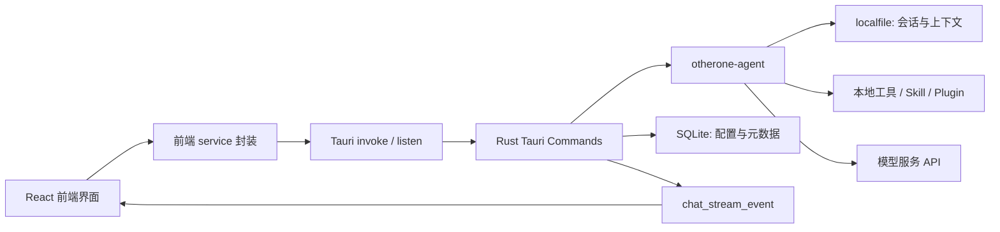

# OtherOne Desktop 答辩技术设计说明

## 适用范围

本文用于毕业答辩或项目答辩时说明 `OtherOne Desktop` 的核心技术设计，重点覆盖：

- 记忆模块的设计和构建
- 上下文模块的设计和构建
- Skill、Plugin、MCP 扩展模块的设计和构建
- 前端开发与技术栈选择
- 技术选型原因、优势和可能被追问的问题

本文基于当前项目代码和文档整理。当前实际后端依赖是 `otherone = "0.1.3"`，部分历史文档仍写 `0.1.2`，答辩时以 `Cargo.toml` 当前配置为准。

## 一句话介绍项目

OtherOne Desktop 是一个运行在本地桌面端的 Agent 智能体应用。它使用 Tauri 作为桌面壳，React 负责用户界面，Rust 负责本地后端和 Agent 调用，基于 `otherone-agent` 框架完成对话、上下文、工具调用、Skill 扩展和本地数据持久化。

## 总体技术栈

| 层级 | 技术 | 作用 |
|---|---|---|
| 桌面应用框架 | Tauri v2 | 提供跨平台桌面窗口、IPC 通信、本地权限控制和系统能力调用 |
| 前端框架 | React 18 + TypeScript | 构建聊天、设置、插件、工作流等交互界面 |
| 构建工具 | Vite 5 | 提供前端开发服务器和生产构建 |
| 后端语言 | Rust 2021 | 实现 Tauri 命令、Agent 调用、本地存储、插件管理和工具执行 |
| Agent 框架 | otherone 0.1.3 | 提供 Agent loop、模型调用、上下文加载、localfile 会话存储和流式事件 |
| 本地数据库 | SQLite + rusqlite | 存储应用配置、模型配置、会话元数据、插件安装状态 |
| 会话存储 | localfile | 存储 otherone-agent 管理的对话、上下文和 session 数据 |
| UI 图标 | lucide-react | 提供桌面应用按钮和功能入口图标 |
| 前后端通信 | Tauri invoke + event | 前端调用 Rust 命令，后端通过事件推送流式消息 |

## 总体架构



这个架构的核心思想是：前端只负责交互和展示，真正涉及本地文件、API Key、模型调用、Agent loop、存储迁移、插件安装的逻辑都放在 Rust 后端。这样可以减少前端暴露敏感能力，也更符合桌面应用本地化运行的要求。

## 记忆模块的设计和构建

### 1. 是什么

项目里的记忆模块主要指“本地会话记忆”和“应用元数据记忆”。

- 会话记忆：由 `otherone-agent` 的 localfile 存储维护，保存用户消息、AI 回复、工具结果、上下文历史等。
- 应用元数据：由 SQLite 维护，保存 API 配置、模型配置、会话标题、置顶状态、归档状态、插件安装状态等。

当前项目不是完整的向量长期记忆库，而是先实现了 Agent 应用最基础、最可靠的本地会话记忆。它的目标是让用户关闭应用后仍能恢复历史对话，并让 Agent 在后续对话中能够读取同一个 session 的历史上下文。

### 2. 为什么这样设计

采用 localfile + SQLite 的组合，是为了把两类数据分开管理：

- `localfile` 适合保存框架原生会话数据。它由 `otherone-agent` 直接读写，兼容框架已有的上下文加载和压缩逻辑。
- `SQLite` 适合保存结构化应用数据。比如模型配置、API Provider、会话标题、置顶和归档状态，这些数据需要查询、排序、更新和迁移。
- 框架数据和应用数据分离，可以避免直接修改框架存储结构，也方便以后升级 `otherone-agent`。
- 桌面端本地存储不依赖服务器，能支持离线查看历史记录，也符合本项目“本地桌面 Agent”的定位。

这套设计的取舍是：短期内没有引入复杂的向量数据库，降低了实现复杂度；但未来如果要做跨会话长期记忆、语义检索和知识库问答，可以在现有 SQLite/localfile 之外再增加向量索引层。

### 3. 怎么做的

记忆模块的实现分成四个部分。

第一，存储路径统一由应用设置管理。

- `dataRoot`：保存 SQLite 数据库和应用通用数据。
- `dialogueRoot`：保存 otherone-agent 的 localfile 对话数据。
- `artifactRoot`：保存 Agent 运行中产生的图片、文件、报告等产物。

其中 localfile 的实际路径是：

```text
{dialogueRoot}/.otherone/storage/otherone-storage.json
```

第二，新会话采用“懒创建”。

用户点击“新对话”时，前端只进入草稿状态，不立即创建空 session。只有用户真正发送第一条消息时，后端才生成或接收 `sessionId`，调用 `Otherone::invoke_agent_stream`，由框架写入第一条用户消息并创建 session。

这样做的原因是避免产生大量空对话，也让会话列表只出现真实发生过交互的记录。

第三，会话列表和详情读取采用 localfile + SQLite 合并。

- `load_sessions` 从 localfile 读取框架 session，再叠加 SQLite 里的标题、置顶、归档等元数据。
- `read_session` 读取某个 session 的 entries，并映射成前端 message group。
- `update_session_title` 只更新 SQLite 的 `session_metadata`，不修改框架 localfile 原始记录。

当前 SQLite 里和记忆相关的表包括：

- `api_providers`
- `api_models`
- `session_metadata`
- `plugin_installs`

第四，对 localfile 访问做串行化保护。

读取 session 时，后端会先获得进程内 mutex，再调用：

```rust
Otherone::set_localfile_root(&storage_root);
```

然后再执行框架 localfile 读写。这样做是为了避免多个读写同时切换 localfile 根目录，降低并发访问导致数据错乱的风险。

## 上下文模块的设计和构建

### 1. 是什么

上下文模块负责决定 Agent 每次请求模型时带哪些历史消息、系统提示词、工具定义、压缩摘要和模型参数。

它不是简单地把所有历史消息拼接给模型，而是基于 `otherone-agent` 的上下文加载机制，按 session 从 localfile 中读取历史记录，并根据上下文窗口和压缩阈值控制最终传给模型的内容。

### 2. 为什么这样设计

大模型有上下文长度限制。如果无节制地把所有历史消息都传给模型，会出现三个问题：

- 性能问题：上下文越长，请求越慢，费用越高。
- 稳定性问题：超过模型上下文窗口后，请求可能失败。
- 质量问题：无关历史过多会干扰当前任务。

因此上下文模块要做三件事：

- 保留当前任务需要的关键信息。
- 在超过阈值时触发上下文压缩。
- 把压缩摘要作为内部上下文使用，而不是直接显示在聊天面板中。

这样既能保证连续对话能力，又能控制 token 成本和响应延迟。

### 3. 怎么做的

后端在发送消息时构造两类配置。

第一类是 `InputOptions`，负责 Agent 和上下文行为：

- `session_id`：指定当前对话所属 session。
- `context_load_type: LocalFile`：从本地文件加载上下文。
- `storage_type: LocalFile`：对话继续写回 localfile。
- `context_window`：控制上下文窗口大小。
- `threshold_percentage`：控制何时触发压缩。
- `max_iterations`：控制 Agent 工具循环最大轮数。

当前实现里，如果前端关闭“压缩上下文”，后端会把阈值设置成 `1.1`，等价于正常情况下不触发压缩。如果打开压缩，则使用引擎设置里的阈值。

第二类是 `AiOptions`，负责模型和推理行为：

- Provider 类型。
- API Key。
- Base URL。
- 模型名称。
- 用户 prompt。
- 系统 prompt。
- temperature / top_p。
- stream。
- tool_choice。
- parallel_tool_calls。
- tools 和 tools_realize。
- reasoning effort 等额外参数。

项目里还做了一个重要保护：没有把“模型上下文容量”直接传给 `AiOptions.context_length`。因为在 otherone 0.1.x 中，这个字段可能会被映射成 OpenAI 的 `max_tokens`，如果把 64k 或 128k 的模型容量传进去，可能形成非法请求。

上下文产生结果后，后端通过流式事件推给前端：

- `user_entry`：用户消息已进入当前会话。
- `assistant_delta`：AI 正文增量。
- `assistant_thinking_delta`：思考内容增量。
- `tool_call` / `tool_calls`：工具调用。
- `complete`：本轮完成。
- `error`：出错。
- `cancelled`：用户取消。

前端使用 `listen('chat_stream_event')` 监听事件，并把增量内容实时合并到当前 AI 消息中。后端统一使用 `app.emit()` 发全局事件，避免 Tauri v2 中窗口定向事件和全局监听不匹配。

## Skill、Plugin、MCP 模块的设计和构建

### 1. 是什么

这个模块的目标是让 Agent 能够扩展能力，而不是把所有能力都硬编码在主程序里。

当前项目中分成三层：

- Skill：一段可加载的 `SKILL.md` 指令，告诉 Agent 在特定任务中应该怎么做。
- Plugin：Skill 加可执行文件或资源包，例如 OfficeCLI，可以让 Agent 调用外部二进制完成更复杂任务。
- MCP：面向未来的标准化工具协议入口，当前前端已有分类入口，后端文档也预留了适配方向，但完整 MCP server 管理和异步调用适配还属于后续增强。

答辩时需要注意边界：当前已实现的是 Skill 和 Plugin 的发现、安装、读取、注入和工具入口；MCP 当前是模块设计和 UI 分类预留，完整 MCP Manager 接入是后续工作。

### 2. 为什么这样设计

Agent 的能力扩展有两个难点：

- 如果把所有能力写死在系统提示词里，prompt 会越来越长，维护困难。
- 如果所有外部工具都写死在主程序里，后续扩展成本高，也不利于第三方能力接入。

所以项目采用“渐进式披露”的思路：

- 平时只把已安装 Skill 和 Plugin 的简要信息放进提示词。
- 当模型判断某个任务需要具体能力时，再调用 `skill` 或 `plugin_tool` 工具加载完整说明。
- 对于包含二进制的 Plugin，只有需要执行时才提供二进制路径和 bin 目录。

这样可以降低系统提示词长度，提高可扩展性，也让插件能力更容易独立更新。

### 3. 怎么做的

Skill 和 Plugin 管理由 Rust 后端完成。

`plugins.rs` 负责：

- 扫描本地 `resources/skills/.../SKILL.md`。
- 解析 Skill 的 frontmatter，提取名称和描述。
- 维护插件列表。
- 安装或卸载 Skill / Plugin。
- 把安装状态写入 SQLite 的 `plugin_installs` 表。
- 缓存已安装 Skill / Plugin 的正文。

`plugin_registry.rs` 负责内置插件注册。目前内置了 `officecli`，它包含：

- 插件名称和描述。
- `SKILL.md` 下载地址。
- 不同平台的二进制下载地址。
- 安装后的 bin 路径。

`tools.rs` 负责把扩展能力暴露给 Agent。它定义了两个关键工具：

- `skill`：根据 skill 名称返回完整 `SKILL.md` 内容。
- `plugin_tool`：根据 plugin 名称返回插件说明、二进制路径和 bin 目录。

同时 `tools.rs` 还注册了基础工具，例如：

- 读取文件。
- 写入文件。
- 编辑文件。
- glob 文件搜索。
- grep 内容搜索。
- web fetch。
- web search。
- shell / PowerShell / REPL 执行。

最后，`chat.rs` 在构造 `AiOptions` 时调用 `tools::build_tools()`，把工具定义和工具实现一起交给 `otherone-agent` 的 Agent loop。

MCP 的设计方向是：后续使用 `otherone-mcp` 的 `McpManager` 接入 stdio、SSE 或 streamable HTTP MCP server，再把 MCP tool 转换成 Agent 可见的工具定义。当前需要解决的技术点是：MCP 调用通常是 async，而当前 `tools_realize` 是同步接口，所以需要增加异步适配层。

## 前端开发

### 1. 是什么

前端是一个 React + TypeScript 的桌面应用界面，主要包括：

- 新对话和聊天页面。
- 会话侧边栏。
- 消息面板。
- 模型和 API 设置。
- 引擎设置。
- 存储路径设置。
- 插件 / Skill / MCP 页面。
- 搜索浮层。
- Toast 通知系统。
- 产物面板。

前端代码位于：

```text
app/frontend/src
```

Rust/Tauri 后端代码位于：

```text
app/frontend/src-tauri/src
```

### 2. 为什么选择这套前端技术

选择 React + TypeScript + Vite + Tauri 的原因：

- React 适合构建复杂状态界面，比如聊天流、设置表单、插件列表和消息分组。
- TypeScript 能约束前后端数据结构，减少字段名、事件类型、配置类型错误。
- Vite 启动快，适合快速调试桌面前端。
- Tauri 比 Electron 更轻，后端使用 Rust，安装包和运行时资源占用更低。
- Tauri 的命令和事件模型适合把敏感操作放到 Rust 后端，比如 API Key、文件读写、插件安装和模型调用。
- 项目 UI 来自 `resources/propertypes` 原型，React 组件化方便按原型逐步复现。

### 3. 怎么做的

前端采用组件 + service 封装的结构。

组件层负责 UI：

- `App.tsx`：主界面、视图切换、全局状态和聊天流集成。
- `MessagePanel.tsx`：消息分组、文本、工具、思考过程和 markdown 渲染。
- `ModelSettings.tsx`：Provider 和模型配置。
- `EngineSettingsPanel.tsx`：Agent 循环、上下文窗口、压缩阈值、系统提示词等设置。
- `PluginsPage.tsx`：Plugin、Skill、MCP 和我的插件界面。
- `ToastSystem.tsx`：全局反馈。

service 层负责调用 Tauri：

- `chatStorage.ts`：发送消息、取消消息、监听流式事件。
- `sessionStorage.ts`：加载会话列表、读取会话详情、更新标题。
- `apiConfigStorage.ts`：读写 API/model 配置。
- `appSettingsStorage.ts`：加载和迁移存储路径、保存引擎设置。
- `pluginService.ts`：加载、安装、卸载插件。

前端不会直接操作 SQLite、localfile 或模型 API，而是通过 Tauri `invoke` 调用 Rust 后端命令。流式对话则通过 Tauri event 回到前端。

## 技术选择原因和优势

### Tauri 的优势

- 应用更轻量，不需要捆绑完整 Chromium。
- Rust 后端适合做本地文件、数据库、插件下载、模型流处理等系统能力。
- 权限模型更清晰，Tauri v2 可以通过 `capabilities/default.json` 控制 API 权限。
- 前端仍然使用 Web 技术，开发效率高。

### Rust 的优势

- 类型安全和内存安全更强。
- 适合做本地高可靠存储、文件迁移、并发控制和工具执行。
- 与 Tauri 集成自然。
- 对桌面应用来说，Rust 后端可以减少把敏感能力暴露给前端 JS 的风险。

### SQLite + localfile 的优势

- SQLite 适合结构化配置和元数据查询。
- localfile 兼容 otherone-agent 的会话和上下文机制。
- 两者都可以本地运行，不依赖服务器。
- 数据迁移可以按目录完成，适合桌面用户自定义存储路径。

### React + TypeScript 的优势

- React 适合聊天类应用的动态状态更新。
- TypeScript 能把流式事件、模型配置、会话数据结构类型化。
- 组件拆分后，设置页、插件页、消息页可以独立维护。

## 答辩时可以这样概括

我的设计思路是把桌面 Agent 拆成四层：

第一层是前端交互层，负责聊天、设置、插件管理和状态展示。

第二层是 Tauri/Rust 本地后端层，负责安全地调用模型、读写本地数据库、管理插件、处理文件和发送流式事件。

第三层是 otherone-agent 能力层，负责 Agent loop、上下文加载、上下文压缩、工具调用和模型流式输出。

第四层是本地数据层，使用 SQLite 保存结构化应用数据，使用 localfile 保存框架原生会话和上下文。

这样设计的原因是：既保留 Web 前端的开发效率，又利用 Rust 和 Tauri 提供本地桌面能力；既复用 otherone-agent 的核心能力，又用 SQLite 管理应用自己的配置和元数据。

## 老师可能提问的问题

### 1. 你的记忆模块具体存了什么？

答：当前记忆模块主要存两类数据。第一类是 Agent 会话数据，包括用户消息、AI 回复、工具结果和上下文历史，这些由 otherone-agent 写入 localfile。第二类是应用元数据，例如会话标题、置顶、归档、API 配置、模型配置和插件安装状态，这些存入 SQLite。这样做可以让框架数据和应用数据解耦。

### 2. 为什么不用一个数据库全部存起来？

答：因为 otherone-agent 已经有自己的 localfile 会话和上下文读写机制，直接复用可以减少适配成本，并保持框架升级兼容性。SQLite 更适合应用层结构化数据查询和更新，比如模型配置和会话标题。所以采用组合式存储，而不是强行把所有数据塞进一个数据库。

### 3. 为什么不用服务器数据库？

答：项目定位是本地桌面 Agent，优先保证本地可运行和本地数据可控。SQLite 和 localfile 不依赖后端服务器，部署简单，也能支持离线查看历史会话。后续如果要做多端同步，可以在本地存储之上再增加同步层。

### 4. 上下文模块怎么保证不会超过模型限制？

答：后端通过 `context_window` 控制上下文窗口，通过 `threshold_percentage` 控制压缩阈值。当上下文接近阈值时，由 otherone-agent 进行上下文压缩，把历史内容压缩成内部摘要。前端只展示真实对话消息，压缩摘要不作为普通消息展示。

### 5. 为什么压缩摘要不显示在聊天界面？

答：压缩摘要是给模型恢复上下文用的内部数据，不是用户真实发送或 AI 真实回复的内容。如果显示出来会干扰用户理解对话。所以它保留在后端上下文链路中，不映射成前端可见消息。

### 6. 流式输出是怎么实现的？

答：前端调用 `send_chat_message` Tauri 命令，Rust 后端启动 `Otherone::invoke_agent_stream`。模型返回 chunk 后，后端把 chunk 转换成统一的 `chat_stream_event`，通过 Tauri `app.emit()` 发送给前端。前端用 `listen('chat_stream_event')` 监听，并把 `assistant_delta` 追加到当前 AI 消息中。

### 7. 为什么要用 Tauri event，不直接等完整结果？

答：Agent 回复可能很长，还可能包含思考过程和工具调用。如果等完整结果，用户会长时间看不到反馈。流式事件可以让用户实时看到输出，提高交互体验，也方便显示工具调用状态和取消对话。

### 8. 你们遇到过流式事件的问题吗？

答：遇到过。Tauri v2 里 `emit_to` 是窗口定向事件，而前端使用的是全局 `listen()`，两者通道不一致会导致前端收不到事件。后来统一改成后端 `app.emit()` 全局广播，并在 `capabilities/default.json` 中加入 `core:default` 权限，解决了事件监听被 ACL 拦截的问题。

### 9. Skill 和 Plugin 的区别是什么？

答：Skill 主要是一个 `SKILL.md` 指令文件，用来告诉 Agent 某类任务的处理步骤。Plugin 是更完整的能力包，可以包含 `SKILL.md` 和可执行二进制，比如 OfficeCLI。Skill 偏提示词和流程，Plugin 偏外部能力集成。

### 10. MCP 模块现在做到什么程度？

答：当前项目已经在前端和插件管理结构中预留了 MCP 分类，后端文档也明确了通过 `otherone-mcp` 接入 stdio、SSE 和 HTTP MCP server 的方向。但当前已完整落地的是 Skill 和 Plugin 的发现、安装、读取和 Agent 工具入口。完整 MCP 调用还需要把 async MCP tool 适配到当前 Agent 的工具执行接口。

### 11. 工具调用怎么接入 Agent？

答：后端在 `tools.rs` 中定义工具 schema 和实现函数，通过 `build_tools()` 返回模型可见的工具定义和 Rust 实现映射。`chat.rs` 构造 `AiOptions` 时把这两部分传给 otherone-agent。模型选择工具后，Agent loop 调用对应 Rust 实现，再把工具结果写回上下文。

### 12. 为什么前端不直接调用模型 API？

答：API Key 和本地路径都属于敏感信息。如果前端直接调用模型 API，密钥容易暴露在 JS 运行环境和日志中。通过 Tauri 后端调用，可以把模型请求、密钥读取、错误处理和日志控制放在 Rust 层，安全边界更清楚。

### 13. 性能方面做了哪些设计？

答：主要有四点。第一，模型回复使用流式事件，减少首屏等待。第二，会话列表读 summary，详情按需读取。第三，上下文通过窗口和压缩阈值控制，避免无限增长。第四，前端对流式消息做增量更新，并通过 `react-virtuoso` 做长消息列表虚拟化，减少长列表渲染成本。

### 14. 数据迁移怎么保证安全？

答：存储路径迁移由 Rust 后端负责。迁移前要求用户确认风险，并且如果当前有活跃聊天流，会阻止迁移。迁移流程是先复制旧数据到新目录，再校验 SQLite 和 localfile 是否可读，校验通过后再保存新路径。这样可以避免路径改了但数据不可用。

### 15. 如果模型请求失败，会话怎么处理？

答：如果第一条用户消息已经写入 localfile，但模型请求失败，项目保留这个只有用户消息的会话。这样用户后续可以重试，而不是把用户输入直接丢掉。

### 16. API Key 安全怎么处理？

答：当前 API Key 通过 Tauri 命令保存到本地 SQLite，不写入浏览器 Web Storage，也不应该出现在日志中。但当前限制是 SQLite 里仍是明文保存。生产级方案需要增加字段加密或接入系统安全存储，例如 Windows Credential Manager、macOS Keychain 或 Tauri 安全存储插件。

### 17. 为什么不用 Electron？

答：Electron 成熟但运行时较重。这个项目需要一个本地 Agent 桌面应用，既要前端开发效率，也要本地文件、数据库、插件管理和 Rust 后端能力。Tauri 更轻，安全模型更严格，也更适合和 Rust 后端结合。

### 18. 为什么选择 Rust 做后端？

答：Rust 类型安全、性能好，适合做桌面端本地能力层。比如 SQLite 读写、localfile 管理、插件下载、工具执行和流式事件处理都需要稳定可靠。Rust 还能减少运行时依赖，和 Tauri 的结合也最自然。

### 19. 前端状态怎么组织？

答：当前主要使用 React 本地状态和 service 封装。service 负责和 Tauri 通信，组件只处理展示和交互。这样在项目早期比引入全局状态库更简单，也符合“先用最小代码解决问题”的原则。后续如果跨页面状态继续增加，可以再引入更明确的状态管理方案。

### 20. 项目还有哪些不足？

答：主要有三点。第一，API Key 需要加密存储。第二，完整 MCP server 管理和调用还需要继续实现。第三，前端可见文案目前较多硬编码，生产化时应补充 i18n 方案。

## 可以主动说明的风险和改进方向

- API Key 当前仍是 SQLite 明文存储，后续应做加密或系统安全存储。
- localfile 默认是明文 JSON，后续可以在适配层增加加密。
- Plugin 下载需要进一步增加 hash 校验、签名验证和来源白名单。
- MCP 需要实现 async 调用适配层，才能完整接入外部 MCP server。
- 长会话列表需要补齐虚拟列表依赖或替代方案。
- 前端国际化和错误提示规范需要生产化整理。
- 如果未来做长期记忆，可以增加向量索引、embedding 和跨会话检索层。

## 结论

这个项目的核心技术路线是：用 Tauri + React 构建桌面交互，用 Rust 承担本地后端能力，用 otherone-agent 提供 Agent loop 和上下文能力，用 SQLite + localfile 完成本地持久化，再通过 Skill、Plugin 和未来 MCP 机制扩展 Agent 能力。

从答辩角度可以总结为三个关键词：

- 本地化：数据、配置、对话和插件都以本地桌面应用为中心。
- 可扩展：Skill、Plugin、MCP 让 Agent 能力可以持续扩展。
- 可控性：Rust 后端负责敏感操作和系统能力，前端只做展示和交互。
