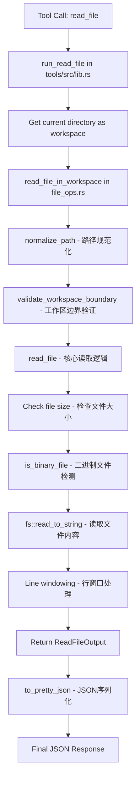

`read_file` 工具的实现主要分布在两个核心文件中：`rust/crates/runtime/src/file_ops.rs`（核心逻辑）和 `rust/crates/tools/src/lib.rs`（工具入口）。

## 核心实现文件

### 1. `rust/crates/runtime/src/file_ops.rs`

这是 `read_file` 的核心实现文件，包含以下关键组件：

#### 数据结构
- `ReadFileOutput` - 输出封装结构，包含文件类型和内容载荷 [1](#1-0) 
- `TextFilePayload` - 文件内容载荷，包含路径、内容、行号等信息 [2](#1-1) 

#### 核心函数
- `read_file()` - 基础读取函数，接受路径、偏移量和限制参数 [3](#1-2) 
- `read_file_in_workspace()` - 带工作区边界检查的读取函数 [4](#1-3) 

### 2. `rust/crates/tools/src/lib.rs`

这是工具注册和执行的入口文件：

- `run_read_file()` - 工具执行入口，调用 `read_file_in_workspace` 并将结果序列化为 JSON [5](#1-4) 

## 实现流程



## 关键安全检查

`read_file` 实现包含多层安全保护：

1. **文件大小限制** - 检查文件是否超过 `MAX_READ_SIZE` [6](#1-5) 
2. **二进制文件检测** - 使用 `is_binary_file()` 拒绝二进制文件 [7](#1-6) 
3. **工作区边界验证** - `read_file_in_workspace` 确保路径不逃逸工作区 [8](#1-7) 
4. **符号链接逃逸检测** - `is_symlink_escape()` 检测符号链接是否指向工作区外部 [9](#1-8) 

## 行窗口处理

`read_file` 支持通过 `offset` 和 `limit` 参数进行分页读取：

```rust
let start_index = offset.unwrap_or(0).min(lines.len());
let end_index = limit.map_or(lines.len(), |limit| {
    start_index.saturating_add(limit).min(lines.len())
});
let selected = lines[start_index..end_index].join("\n");
​``` [10](#1-9) 

## 测试覆盖

实现包含完整的测试用例：

- 单元测试验证基本读写功能 [11](#1-10) 
- 二进制文件拒绝测试 [12](#1-11) 
- 符号链接逃逸防护测试 [13](#1-12) 
- 集成测试验证完整的 roundtrip 流程 [14](#1-13) 

## 导出和公开API

`rust/crates/runtime/src/lib.rs` 重新导出了这些函数，使其在整个 runtime crate 中可用 [15](#1-14) 。

## Notes

`read_file` 工具在 Lane 3 中完成了边缘情况防护（二进制检测、大小限制、工作区边界、符号链接逃逸） [16](#1-15) 。工具支持多种命名变体（`read`、`Read`、`read_file`） [17](#1-16) 。

Wiki pages you might want to explore:
- [Testing and CI (ultraworkers/claw-code)](/wiki/ultraworkers/claw-code#5)
- [Glossary (ultraworkers/claw-code)](/wiki/ultraworkers/claw-code#6)

### Citations

**File:** rust/crates/runtime/src/file_ops.rs (L58-68)
​```rust
pub struct TextFilePayload {
    #[serde(rename = "filePath")]
    pub file_path: String,
    pub content: String,
    #[serde(rename = "numLines")]
    pub num_lines: usize,
    #[serde(rename = "startLine")]
    pub start_line: usize,
    #[serde(rename = "totalLines")]
    pub total_lines: usize,
}
```

**File:** rust/crates/runtime/src/file_ops.rs (L72-76)
```rust
pub struct ReadFileOutput {
    #[serde(rename = "type")]
    pub kind: String,
    pub file: TextFilePayload,
}
```

**File:** rust/crates/runtime/src/file_ops.rs (L185-231)
```rust
pub fn read_file(
    path: &str,
    offset: Option<usize>,
    limit: Option<usize>,
) -> io::Result<ReadFileOutput> {
    let absolute_path = normalize_path(path)?;

    // Check file size before reading
    let metadata = fs::metadata(&absolute_path)?;
    if metadata.len() > MAX_READ_SIZE {
        return Err(io::Error::new(
            io::ErrorKind::InvalidData,
            format!(
                "file is too large ({} bytes, max {} bytes)",
                metadata.len(),
                MAX_READ_SIZE
            ),
        ));
    }

    // Detect binary files
    if is_binary_file(&absolute_path)? {
        return Err(io::Error::new(
            io::ErrorKind::InvalidData,
            "file appears to be binary",
        ));
    }

    let content = fs::read_to_string(&absolute_path)?;
    let lines: Vec<&str> = content.lines().collect();
    let start_index = offset.unwrap_or(0).min(lines.len());
    let end_index = limit.map_or(lines.len(), |limit| {
        start_index.saturating_add(limit).min(lines.len())
    });
    let selected = lines[start_index..end_index].join("\n");

    Ok(ReadFileOutput {
        kind: String::from("text"),
        file: TextFilePayload {
            file_path: absolute_path.to_string_lossy().into_owned(),
            content: selected,
            num_lines: end_index.saturating_sub(start_index),
            start_line: start_index.saturating_add(1),
            total_lines: lines.len(),
        },
    })
}
```

**File:** rust/crates/runtime/src/file_ops.rs (L678-688)
```rust
pub fn read_file_in_workspace(
    path: &str,
    offset: Option<usize>,
    limit: Option<usize>,
    workspace_root: &Path,
) -> io::Result<ReadFileOutput> {
    let absolute_path = normalize_path(path)?;
    let canonical_root = canonicalize_workspace_root(workspace_root);
    validate_workspace_boundary(&absolute_path, &canonical_root)?;
    read_file(path, offset, limit)
}
```

**File:** rust/crates/runtime/src/file_ops.rs (L739-749)
```rust
pub fn is_symlink_escape(path: &Path, workspace_root: &Path) -> io::Result<bool> {
    let metadata = fs::symlink_metadata(path)?;
    if !metadata.is_symlink() {
        return Ok(false);
    }
    let resolved = path.canonicalize()?;
    let canonical_root = workspace_root
        .canonicalize()
        .unwrap_or_else(|_| workspace_root.to_path_buf());
    Ok(!resolved.starts_with(&canonical_root))
}
```

**File:** rust/crates/runtime/src/file_ops.rs (L793-802)
```rust
    fn reads_and_writes_files() {
        let path = temp_path("read-write.txt");
        let write_output = write_file(path.to_string_lossy().as_ref(), "one\ntwo\nthree")
            .expect("write should succeed");
        assert_eq!(write_output.kind, "create");

        let read_output = read_file(path.to_string_lossy().as_ref(), Some(1), Some(1))
            .expect("read should succeed");
        assert_eq!(read_output.file.content, "two");
    }
```

**File:** rust/crates/runtime/src/file_ops.rs (L815-823)
```rust
    fn rejects_binary_files() {
        let path = temp_path("binary-test.bin");
        std::fs::write(&path, b"\x00\x01\x02\x03binary content").expect("write should succeed");
        let result = read_file(path.to_string_lossy().as_ref(), None, None);
        assert!(result.is_err());
        let error = result.unwrap_err();
        assert_eq!(error.kind(), std::io::ErrorKind::InvalidData);
        assert!(error.to_string().contains("binary"));
    }
```

**File:** rust/crates/runtime/src/file_ops.rs (L883-907)
```rust
    fn workspace_read_rejects_symlink_escape_regression_3007_class() {
        let workspace = temp_path("workspace-read-symlink-escape");
        let outside = temp_path("workspace-read-symlink-target");
        std::fs::create_dir_all(&workspace).expect("workspace dir should be created");
        std::fs::create_dir_all(&outside).expect("outside dir should be created");
        let outside_file = outside.join("secret.txt");
        std::fs::write(&outside_file, "outside secret").expect("outside file should write");

        let link_path = workspace.join("linked-secret.txt");
        std::os::unix::fs::symlink(&outside_file, &link_path).expect("symlink should create");

        let result =
            read_file_in_workspace(link_path.to_string_lossy().as_ref(), None, None, &workspace);

        assert!(result.is_err(), "symlink escape must be rejected");
        let error = result.unwrap_err();
        assert_eq!(error.kind(), std::io::ErrorKind::PermissionDenied);
        assert!(
            error.to_string().contains("escapes workspace"),
            "error should explain workspace escape: {error}"
        );

        let _ = std::fs::remove_dir_all(&workspace);
        let _ = std::fs::remove_dir_all(&outside);
    }
```

**File:** rust/crates/tools/src/lib.rs (L2110-2116)
```rust
fn run_read_file(input: ReadFileInput) -> Result<String, String> {
    let workspace = std::env::current_dir().map_err(|error| error.to_string())?;
    to_pretty_json(
        read_file_in_workspace(&input.path, input.offset, input.limit, &workspace)
            .map_err(io_to_string)?,
    )
}
```

**File:** rust/crates/rusty-claude-cli/tests/compact_output.rs (L15-79)
```rust
fn compact_flag_prints_only_final_assistant_text_without_tool_call_details() {
    // given a workspace pointed at the mock Anthropic service and a fixture file
    // that the read_file_roundtrip scenario will fetch through a tool call
    let runtime = tokio::runtime::Runtime::new().expect("tokio runtime should build");
    let server = runtime
        .block_on(MockAnthropicService::spawn())
        .expect("mock service should start");
    let base_url = server.base_url();

    let workspace = unique_temp_dir("compact-read-file");
    let config_home = workspace.join("config-home");
    let home = workspace.join("home");
    fs::create_dir_all(&workspace).expect("workspace should exist");
    fs::create_dir_all(&config_home).expect("config home should exist");
    fs::create_dir_all(&home).expect("home should exist");
    fs::write(workspace.join("fixture.txt"), "alpha parity line\n").expect("fixture should write");

    // when we run claw in compact text mode against a tool-using scenario
    let prompt = format!("{SCENARIO_PREFIX}read_file_roundtrip");
    let output = run_claw(
        &workspace,
        &config_home,
        &home,
        &base_url,
        &[
            "--model",
            "sonnet",
            "--permission-mode",
            "read-only",
            "--allowedTools",
            "read_file",
            "--compact",
            &prompt,
        ],
    );

    // then the command exits successfully and stdout contains exactly the final
    // assistant text with no tool call IDs, JSON envelopes, or spinner output
    assert!(
        output.status.success(),
        "compact run should succeed\nstdout:\n{}\n\nstderr:\n{}",
        String::from_utf8_lossy(&output.stdout),
        String::from_utf8_lossy(&output.stderr),
    );
    let stdout = String::from_utf8(output.stdout).expect("stdout should be utf8");
    let trimmed = stdout.trim_end_matches('\n');
    assert_eq!(
        trimmed, "read_file roundtrip complete: alpha parity line",
        "compact stdout should contain only the final assistant text"
    );
    assert!(
        !stdout.contains("toolu_"),
        "compact stdout must not leak tool_use_id ({stdout:?})"
    );
    assert!(
        !stdout.contains("\"tool_uses\""),
        "compact stdout must not leak json envelopes ({stdout:?})"
    );
    assert!(
        !stdout.contains("Thinking"),
        "compact stdout must not include the spinner banner ({stdout:?})"
    );

    fs::remove_dir_all(&workspace).expect("workspace cleanup should succeed");
}
```

**File:** rust/crates/runtime/src/lib.rs (L83-88)
```rust
pub use file_ops::{
    edit_file, edit_file_in_workspace, glob_search, glob_search_in_workspace, grep_search,
    grep_search_in_workspace, read_file, read_file_in_workspace, write_file,
    write_file_in_workspace, EditFileOutput, GlobSearchOutput, GrepSearchInput, GrepSearchOutput,
    ReadFileOutput, StructuredPatchHunk, TextFilePayload, WriteFileOutput,
};
```

**File:** PARITY.md (L77-83)
```markdown
### Lane 3 — File-tool

- **Status:** merged on `main`.
- **Feature commit:** `284163b` — `feat(file_ops): add edge-case guards — binary detection, size limits, workspace boundary, symlink escape`
- **Merge commit:** `a98f2b6` — `Merge jobdori/file-tool-edge-cases: binary detection, size limits, workspace boundary guards`
- **Evidence:** `rust/crates/runtime/src/file_ops.rs` is **744 LOC** and now includes `MAX_READ_SIZE`, `MAX_WRITE_SIZE`, NUL-byte binary detection, and canonical workspace-boundary validation.
- **Harness coverage:** `read_file_roundtrip`, `grep_chunk_assembly`, `write_file_allowed`, and `write_file_denied` are in the manifest and exercised by the clean-env harness.
```

**File:** ROADMAP.md (L4447-4457)
```markdown
     # For canonical "read_file" (snake_case):
     $ claw --allowedTools read_file status --output-format json | head -1
     { ... accepted (exact)
     $ claw --allowedTools READ_FILE status | head -1
     { ... accepted (case-insensitive)
     $ claw --allowedTools Read-File status | head -1
     { ... accepted (hyphen → underscore normalization)
     $ claw --allowedTools Read status | head -1
     { ... accepted (alias "read" → "read_file")
     $ claw --allowedTools ReadFile status | head -1
     {"error":"unsupported tool in --allowedTools: ReadFile"}   # REJECTED
```