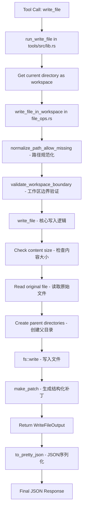

`write_file` 工具的实现主要分布在两个核心文件中：`rust/crates/runtime/src/file_ops.rs`（核心逻辑）和 `rust/crates/tools/src/lib.rs`（工具入口）。

## 核心实现文件

### 1. `rust/crates/runtime/src/file_ops.rs`

这是 `write_file` 的核心实现文件，包含以下关键组件：

#### 数据结构
- `WriteFileOutput` - 输出封装结构，包含操作类型、文件路径、内容、结构化补丁等信息 [1](#2-0) 
- `StructuredPatchHunk` - 结构化补丁块，用于表示文件变更的详细信息 [2](#2-1) 

#### 核心函数
- `write_file()` - 基础写入函数，接受路径和内容参数 [3](#2-2) 
- `write_file_in_workspace()` - 带工作区边界检查的写入函数 [4](#2-3) 

### 2. `rust/crates/tools/src/lib.rs`

这是工具注册和执行的入口文件：

- `run_write_file()` - 工具执行入口，调用 `write_file_in_workspace` 并将结果序列化为 JSON [5](#2-4) 

## 实现流程



## 核心实现逻辑

`write_file()` 函数的实现包含以下关键步骤：

1. **内容大小检查** - 检查内容是否超过 `MAX_WRITE_SIZE`（10MB） [6](#2-5) 
2. **路径规范化** - 使用 `normalize_path_allow_missing()` 处理路径，允许文件不存在 [7](#2-6) 
3. **读取原始文件** - 尝试读取现有文件内容，用于生成补丁 [8](#2-7) 
4. **创建父目录** - 如果父目录不存在，则创建 [9](#2-8) 
5. **写入文件** - 使用 `fs::write()` 写入新内容 [10](#2-9) 
6. **生成补丁** - 使用 `make_patch()` 生成结构化补丁 [11](#2-10) 
7. **返回结果** - 根据原始文件是否存在，返回 "create" 或 "update" 类型 [12](#2-11) 

## 工作区边界保护

`write_file_in_workspace()` 提供了工作区边界保护：

```rust
pub fn write_file_in_workspace(
    path: &str,
    content: &str,
    workspace_root: &Path,
) -> io::Result<WriteFileOutput> {
    let absolute_path = normalize_path_allow_missing(path)?;
    let canonical_root = canonicalize_workspace_root(workspace_root);
    validate_workspace_boundary(&absolute_path, &canonical_root)?;
    write_file(path, content)
}
​``` [4](#2-3) 

## 测试覆盖

实现包含完整的测试用例：

- 基本读写功能测试 [13](#2-12) 
- 超大写入拒绝测试 [14](#2-13) 

## 导出和公开API

`rust/crates/runtime/src/lib.rs` 重新导出了这些函数，使其在整个 runtime crate 中可用 [15](#2-14) 。

## Notes

`write_file` 工具在 Lane 3 中完成了边缘情况防护（二进制检测、大小限制、工作区边界、符号链接逃逸） [16](#2-15) 。工具支持创建新文件和更新现有文件，并通过结构化补丁提供变更可视化 [12](#2-11) 。

Wiki pages you might want to explore:
- [Runtime and Conversation Engine (ultraworkers/claw-code)](/wiki/ultraworkers/claw-code#2.2)

### Citations

**File:** rust/crates/runtime/src/file_ops.rs (L78-90)
​```rust
/// Structured patch hunk emitted by write and edit operations.
#[derive(Debug, Clone, Serialize, Deserialize, PartialEq, Eq)]
pub struct StructuredPatchHunk {
    #[serde(rename = "oldStart")]
    pub old_start: usize,
    #[serde(rename = "oldLines")]
    pub old_lines: usize,
    #[serde(rename = "newStart")]
    pub new_start: usize,
    #[serde(rename = "newLines")]
    pub new_lines: usize,
    pub lines: Vec<String>,
}
```

**File:** rust/crates/runtime/src/file_ops.rs (L92-106)
```rust
/// Output envelope for full-file write operations.
#[derive(Debug, Clone, Serialize, Deserialize, PartialEq, Eq)]
pub struct WriteFileOutput {
    #[serde(rename = "type")]
    pub kind: String,
    #[serde(rename = "filePath")]
    pub file_path: String,
    pub content: String,
    #[serde(rename = "structuredPatch")]
    pub structured_patch: Vec<StructuredPatchHunk>,
    #[serde(rename = "originalFile")]
    pub original_file: Option<String>,
    #[serde(rename = "gitDiff")]
    pub git_diff: Option<serde_json::Value>,
}
```

**File:** rust/crates/runtime/src/file_ops.rs (L233-265)
```rust
/// Replaces a file's contents and returns patch metadata.
pub fn write_file(path: &str, content: &str) -> io::Result<WriteFileOutput> {
    if content.len() > MAX_WRITE_SIZE {
        return Err(io::Error::new(
            io::ErrorKind::InvalidData,
            format!(
                "content is too large ({} bytes, max {} bytes)",
                content.len(),
                MAX_WRITE_SIZE
            ),
        ));
    }

    let absolute_path = normalize_path_allow_missing(path)?;
    let original_file = fs::read_to_string(&absolute_path).ok();
    if let Some(parent) = absolute_path.parent() {
        fs::create_dir_all(parent)?;
    }
    fs::write(&absolute_path, content)?;

    Ok(WriteFileOutput {
        kind: if original_file.is_some() {
            String::from("update")
        } else {
            String::from("create")
        },
        file_path: absolute_path.to_string_lossy().into_owned(),
        content: content.to_owned(),
        structured_patch: make_patch(original_file.as_deref().unwrap_or(""), content),
        original_file,
        git_diff: None,
    })
}
```

**File:** rust/crates/runtime/src/file_ops.rs (L690-701)
```rust
/// Write a file with workspace boundary enforcement.
#[allow(dead_code)]
pub fn write_file_in_workspace(
    path: &str,
    content: &str,
    workspace_root: &Path,
) -> io::Result<WriteFileOutput> {
    let absolute_path = normalize_path_allow_missing(path)?;
    let canonical_root = canonicalize_workspace_root(workspace_root);
    validate_workspace_boundary(&absolute_path, &canonical_root)?;
    write_file(path, content)
}
```

**File:** rust/crates/runtime/src/file_ops.rs (L793-802)
```rust
    fn reads_and_writes_files() {
        let path = temp_path("read-write.txt");
        let write_output = write_file(path.to_string_lossy().as_ref(), "one\ntwo\nthree")
            .expect("write should succeed");
        assert_eq!(write_output.kind, "create");

        let read_output = read_file(path.to_string_lossy().as_ref(), Some(1), Some(1))
            .expect("read should succeed");
        assert_eq!(read_output.file.content, "two");
    }
```

**File:** rust/crates/runtime/src/file_ops.rs (L826-834)
```rust
    fn rejects_oversized_writes() {
        let path = temp_path("oversize-write.txt");
        let huge = "x".repeat(MAX_WRITE_SIZE + 1);
        let result = write_file(path.to_string_lossy().as_ref(), &huge);
        assert!(result.is_err());
        let error = result.unwrap_err();
        assert_eq!(error.kind(), std::io::ErrorKind::InvalidData);
        assert!(error.to_string().contains("too large"));
    }
```

**File:** rust/crates/tools/src/lib.rs (L2118-2124)
```rust
#[allow(clippy::needless_pass_by_value)]
fn run_write_file(input: WriteFileInput) -> Result<String, String> {
    let workspace = std::env::current_dir().map_err(|error| error.to_string())?;
    to_pretty_json(
        write_file_in_workspace(&input.path, &input.content, &workspace).map_err(io_to_string)?,
    )
}
```

**File:** rust/crates/runtime/src/lib.rs (L83-88)
```rust
pub use file_ops::{
    edit_file, edit_file_in_workspace, glob_search, glob_search_in_workspace, grep_search,
    grep_search_in_workspace, read_file, read_file_in_workspace, write_file,
    write_file_in_workspace, EditFileOutput, GlobSearchOutput, GrepSearchInput, GrepSearchOutput,
    ReadFileOutput, StructuredPatchHunk, TextFilePayload, WriteFileOutput,
};
```

**File:** PARITY.md (L77-83)
```markdown
### Lane 3 — File-tool

- **Status:** merged on `main`.
- **Feature commit:** `284163b` — `feat(file_ops): add edge-case guards — binary detection, size limits, workspace boundary, symlink escape`
- **Merge commit:** `a98f2b6` — `Merge jobdori/file-tool-edge-cases: binary detection, size limits, workspace boundary guards`
- **Evidence:** `rust/crates/runtime/src/file_ops.rs` is **744 LOC** and now includes `MAX_READ_SIZE`, `MAX_WRITE_SIZE`, NUL-byte binary detection, and canonical workspace-boundary validation.
- **Harness coverage:** `read_file_roundtrip`, `grep_chunk_assembly`, `write_file_allowed`, and `write_file_denied` are in the manifest and exercised by the clean-env harness.
```